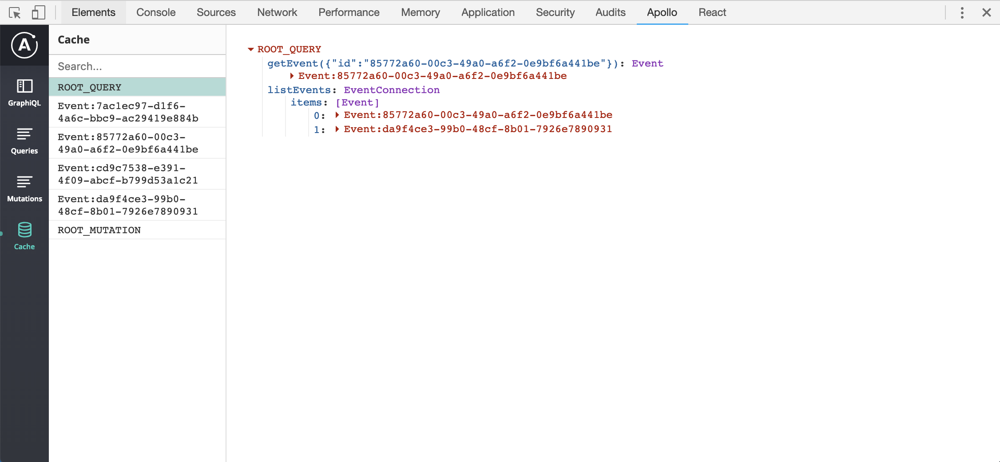

import { Head, Notes, Image } from "mdx-deck";
import { Invert } from "mdx-deck/layouts";

<title>Introduction to GraphQL</title>

export { default as theme } from "./src/theme";

# Introduction to GraphQL

<Notes>
  <ul>
    <li>What is GraphQL</li>
    <li>Why it could be interesting to maybe consider in your next project</li>
    <li>How to use it with React using the Apollo Client</li>
    <li>
      Round of with a short demo where we look at some of the UI update
      strategies
    </li>
  </ul>
</Notes>

---

# Trackunit

- API Gateway for apps and new manager
- (Soon) external API for their customers

---

<Image
  src="./src/images/graphql-arc.png"
  style={{ height: "70vh", backgroundSize: "contain" }}
/>

---

# What is GraphQL?

---

# A super flexible query language for your APIs

- Language and specification was initially developed by Facebook
- Described by fields and their type

---

export default Invert;

# Query

`POST /graphql`

```
query getMachine($id: ID!) {
  machine(input: { id: $id }) {
    id
    name
    metadata {
      category
      model
      brand
    }
  }
}
```

---

export default Invert;

# Response

```json
{
  "data": {
    "machine": {
      "id": "da9f4ce3-99b0-48cf-8b01-7926e7890931",
      "name": "U.S. Air Force One",
      "metadata": {
        "category": "Plane",
        "model": "747-8s",
        "brand": "Boeing"
      }
    }
  }
}
```

---

# Why bother?

---

# Language agnostic

- Unified API based on multiple services
- Each used service can use the best tools and databases for the job

---

# Strongly typed

- Both when developing and quering
- Self documenting
- Clear and helpful errors
- Null safety
- Auto completion of queries
- Generate types in your projects based on schema

---

# Easy to maintain

- One endpoint
- No versioning - just add new stuff to the schema
- Old fields are deprecated

---

# Performant

- Get exactly the data that you need and nothing more
- Reduce size of payload
- Saves requests by avoiding roundtrips to the server
- Get data from many services in a single request
- Automatically resolves values in parallel

---

# Great tooling

---

<iframe src="http://localhost:5000" style={{ width: "90vw", height: "90vh" }} />

---

# Under the hood

- GraphQL Schema defines the data available
- Each field has an associated resolver
- Generate TypeScript templates based on schema

---

# GraphQL Schema

<small style={{fontSize: '0.8em'}}>

```
schema {
  query: Query
  mutation: Mutation
}

type Query {
  machines(input: MachinesInput!): [Machine!]
}

type Machine {
  id: ID!
  name: String
  metadata: MachineMetadata!
  criticality: Criticality!
}
```

</small>

---

# Resolvers

- Each resolver knows: `parent value`, `arguments`, `context`

```js
const machineResolver: MachineResolvers = {
  name: parent => parent.name,

  criticality: async (parent, args, context) => {
    const scoredUnit = await context.eventLogApi.getScoredUnit(parent.machineId);
    return scoredUnit.criticality as Criticality ?? Criticality.None;
  },
}
```

---

# Mutations

- Create/update/delete operations
- Should be placed at root level 😒

```
mutation updateMachine($id: ID!, $input: MachineInput!) {
  updateMachine(id: $id, input: $input) {
    id
    name
  }
}
```

---

# Frontend clients

- Relay
- AWS Amplify
- Apollo Client
- ...

---

# Apollo Client

- Clients for React and all major frontend libraries and iOS/Android
- Actively developed
- Good documentation
- Great caching out of the box

---

# Query

export default Invert;

<small style={{fontSize: '0.7em'}}>

```
query getMachine($id: Int!) {
  machine(input: { id: $id }) {
    id
    name
    metadata {
      category
      model
      brand
    }
  }
}
```

```js
export function useGetMachine(machineId: number) {
  const { data, loading, error } = useGetMachineQuery({
    variables: { id: machineId },
  });
  return {
    data: data?.machine,
    loading,
    error,
  };
}
```

</small>

---



<Notes>
  <ul>
    <li>Apollo client devtool</li>
    <li>Overview of active queries and mutations and their response</li>
    <li>What’s going on in the cache</li>
  </ul>
</Notes>

---

# Dataloaders

- Batch calls to resources

---

# Subscription

- WebSockets as you know it - but through GraphQL

---

# What are the drawbacks?

- No generics 😥
- Prevent breaking changes to schema
- Extra code on top of your existing APIs
- Best for read-only. Mutations isn't structured nicely
- Few good **free** tools to monitor usage

---


